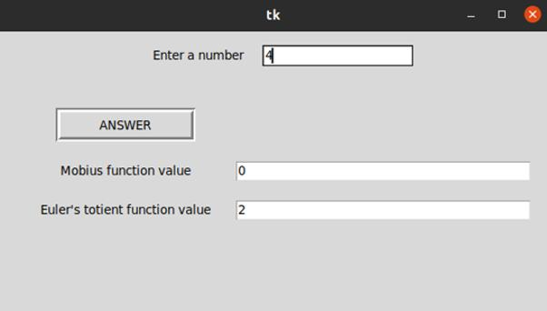
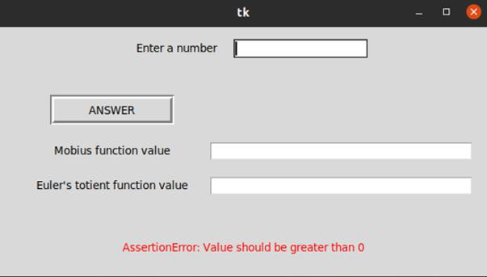

## About this project

This is a simple GUI based python program to calculate the Mobius function value and Euler's totient function value of a number inputted in the GUI window. The user inputs the number in the entry widget in the GUI which is labelled as "Enter a number", and he get' an ouput of the mobius as well as euler'e totient function output.

#### Images of test cases -

### Error handling

Mainly there can be two types of errors:
1. ValueError: The input to the function must be only integers and not any other literal.
2. AssertionError: The input integer must be greater than zero, as non postive integers are not in domain of these functions.

These errors are handled in this program, and the error message is displayed in the GUI window.

#### Error testcase

Note - All the values get cleared if error, except for the error label. In the above example, the input value was -4.

### Log file
The log file contains details of all the operations performed by the user, including input and getting an output, as well as details if any error has occurred. The format is `Date - Time [ERROR] --- Value input : value`

If no error, the error term is displayed as `[ERROR: None]`
